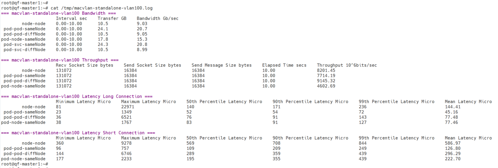

# multus-underlay performance test in each network mode

## requirement
1. at least two node in cluster
2. multus-underlay installed
3. spiderpool installed

## test tools
- netperf
- iperf

## test indicators
- latency
- throughput
- bandwidth

## supported test point
- between node and node
- between node and its pod
- between pod and service whose endpoint at the same node with the pod
- between pod and service whose endpoint at the different node with the pod

## usage
1. copy the directory "multus-underlay" of the project to one of your cluster master node
2. edit file "test.config" as required, it will run some test pod used different cni according parameters you passed in
3. run `bash test.sh` under directory "multus-underlay"
4. this shell script will output a log file such as:  
    
